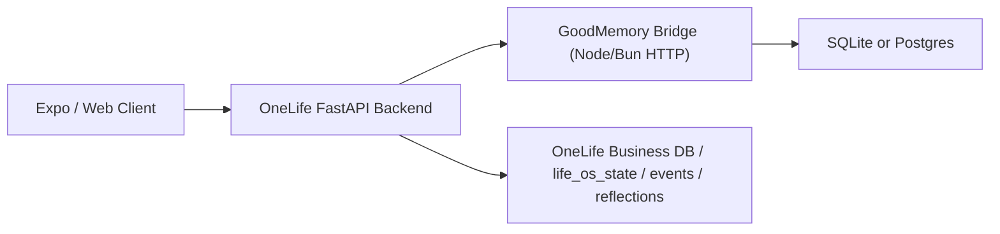

# GoodMemory 接入 OneLife 指南

这份文档说明 OneLife 应该如何接入 GoodMemory。

先把边界说清楚：

- GoodMemory 是通用记忆中间层。
- OneLife 只是一个 reference use case。
- 这份文档讲的是 OneLife 这个用例怎么落地，不是把 GoodMemory 做成
  OneLife 专用库。

目标不是把 GoodMemory 塞进 Expo 客户端，也不是让 GoodMemory 取代
OneLife 现有的 `life_os_state`、`agent-session`、`memory policy` 体系。
目标是把 GoodMemory 作为通用语义记忆层，让 OneLife 这个 Python/FastAPI
后端用例可以稳定调用它。

## 1. 推荐架构



推荐边界：

- 客户端只调用 OneLife 的 FastAPI。
- OneLife 的 FastAPI 再调用 GoodMemory bridge。
- GoodMemory bridge 内部只使用 GoodMemory 的公开 API。
- GoodMemory bridge 是 backend-only/internal service boundary，不应该直接暴露给
  浏览器或移动端；OneLife FastAPI 负责认证、授权和跨用户/租户 scope 校验。
- `life_os_state`、反思记录、事件流、用户控制和产品策略仍由 OneLife 自己拥有。

不要这样做：

- 不要把 GoodMemory 直接跑在 Expo 客户端里。
- 不要让客户端直接访问 GoodMemory 存储。
- 不要把 OneLife 的产品策略硬编码进 GoodMemory core。
- 不要把原始 transcript 默认持久化成长期记忆。

## 2. 为什么是后端 sidecar，而不是客户端集成

原因很直接：

- GoodMemory 是 TypeScript/Node/Bun 服务端库，不是 React Native 库。
- OneLife 已经有 Python/FastAPI 后端边界，GoodMemory 应该挂在这里。
- 记忆写入、用户控制、审计、删除、导出都更适合放在后端完成。
- SQLite 只适合本地或单写者部署；生产多实例最终应迁到 Postgres，这也属于后端基础设施问题。

结论：

- Expo/Web 不需要知道 GoodMemory 的存在。
- OneLife 只需要知道五个核心 HTTP endpoint，外加一个 targeted correction
  endpoint。

## 3. 推荐暴露的接口

这些接口应该只被 OneLife FastAPI 或等价的后端服务调用。`export`、`forget`
和 `revise` 必须经过产品侧授权，并且请求 scope 必须绑定当前用户和租户/环境，
不能让 bridge 自己猜测“谁有权改哪条记忆”。

### 3.1 `POST /memory/recall-context`

用途：

- 给 OneLife 当前这一轮对话取回记忆。
- 同时返回 prompt-ready context 和紧凑结构化条目。

推荐请求：

```json
{
  "scope": {
    "userId": "user-123",
    "sessionId": "sess-456",
    "workspaceId": "onelife-prod",
    "agentId": "life-coach"
  },
  "query": "我最近总是拖延，今天应该先做什么？",
  "retrievalProfile": "general_chat",
  "build": {
    "output": "system_prompt_fragment"
  }
}
```

推荐响应：

```json
{
  "context": "Use the following memory only when relevant: ...",
  "contextOutput": "system_prompt_fragment",
  "hasContext": true,
  "itemCount": 3,
  "items": [
    {
      "id": "fact_1",
      "layer": "identity",
      "kind": "semantic_memory",
      "content": "我是一个会兑现承诺的人",
      "confidence": 0.92,
      "sourceType": "profile",
      "sourceId": "mem_123",
      "userConfirmed": true
    }
  ],
  "traceId": "trace_abc"
}
```

这个 endpoint 在 bridge 侧实际上做的是：

1. `memory.recall(...)`
2. `memory.buildContext(...)`
3. 把 recall 结果适配成 OneLife 当前易消费的紧凑条目

### 3.2 `POST /memory/remember`

用途：

- 把当前会话里值得沉淀的内容写入 GoodMemory。

推荐请求：

```json
{
  "scope": {
    "userId": "user-123",
    "sessionId": "sess-456",
    "workspaceId": "onelife-prod",
    "agentId": "life-coach"
  },
  "messages": [
    {
      "role": "user",
      "content": "我这季度最重要的目标是把睡眠恢复到稳定状态。"
    },
    {
      "role": "assistant",
      "content": "我们先把固定入睡时间作为第一步。"
    },
    {
      "role": "user",
      "content": "好，这个方法我接受。"
    }
  ],
  "annotations": [
    {
      "messageIndex": 1,
      "remember": "always",
      "kindHint": "fact",
      "confirmed": true,
      "metadataPatch": {
        "category": "habit",
        "tags": ["onelife", "sleep", "weekly_plan"],
        "attributes": {
          "cadence": "daily"
        }
      }
    }
  ],
  "mode": "sync",
  "idempotencyKey": "sess-456:turn-12"
}
```

bridge 内部推荐这样处理：

- `mode=sync` 时直接调用 `memory.remember(...)`
- `mode=async` 时调用 `memory.jobs.enqueueRemember(...)`
- `idempotencyKey` 由 OneLife 后端生成，建议使用 `session_id + turn_id`

这里的 `mode` 只是 HTTP bridge 的 transport/control 字段。它不能作为
`memory.remember()` 的新参数向下透传，也不意味着 GoodMemory root API 支持
`remember({ mode: "background" })`。异步写入应该显式走
`memory.jobs.enqueueRemember(...)`。

### 3.3 `POST /memory/feedback`

用途：

- 记录“这种干预方式是否有效”这类 procedural feedback。
- 这不是普通 remember 的替代品。

推荐请求：

```json
{
  "scope": {
    "userId": "user-123",
    "workspaceId": "onelife-prod",
    "agentId": "life-coach"
  },
  "signal": "User confirmed that direct, firm coaching with one concrete next step worked well."
}
```

什么时候用 `feedback`：

- 用户明确说某种教练风格有效/无效
- 某种 intervention 被验证有效
- 你要沉淀的是“做法和结果”，不是一般事实

什么时候不要用 `feedback`：

- 用户只是聊了一件事
- 你只是想存一个目标/偏好/事实

### 3.4 `POST /memory/forget`

用途：

- 删除某条用户要求忘记的记忆。

推荐请求：

```json
{
  "scope": {
    "userId": "user-123",
    "workspaceId": "onelife-prod",
    "agentId": "life-coach"
  },
  "memoryId": "mem_123"
}
```

这个接口应该接在 OneLife 的用户控制界面后面，不应该只给内部调试用。

### 3.5 `POST /memory/export`

用途：

- 给用户查看当前记忆
- 做客服/调试导出
- 作为 OneLife “用户可见的重要记忆” 页面数据源

推荐请求：

```json
{
  "scope": {
    "userId": "user-123",
    "workspaceId": "onelife-prod",
    "agentId": "life-coach"
  },
  "includeRuntime": false
}
```

默认 `includeRuntime=false`。即使未来允许导出 runtime 信息，也只能是
summary-only 视图，不应包含 raw transcript archive。

### 3.6 `POST /memory/revise`

用途：

- 修改一条用户已经看见并明确指向的记忆。
- 只包装 Phase 38 已接受的 targeted `reviseMemory()`。
- 不做 query-resolved target，不根据自然语言自动猜要改哪条 memory。

推荐请求：

```json
{
  "scope": {
    "userId": "user-123",
    "workspaceId": "onelife-prod",
    "agentId": "life-coach"
  },
  "target": {
    "memoryId": "mem_123"
  },
  "revision": {
    "content": "用户现在更喜欢晚上复盘，而不是早上复盘。"
  },
  "reason": "user_correction",
  "evidence": {
    "source": "user_message",
    "message": "其实我现在更喜欢晚上复盘。"
  },
  "idempotencyKey": "user-123:correction-42"
}
```

bridge 内部只能调用：

```ts
await memory.reviseMemory({
  scope,
  target: { memoryId },
  revision,
  reason: "user_correction",
  evidence,
  idempotencyKey,
});
```

如果 OneLife 还没有 resolve 到明确的 `memoryId`，这个 endpoint 应该拒绝请求，
由 OneLife 先在用户可见记忆列表或产品状态里完成 target resolution。

## 4. OneLife 现有模型和 GoodMemory 的职责分工

### OneLife 继续拥有的部分

- `life_os_state`
- `agent-session`
- reflections / events / business tables
- Memory policy
- 用户确认、编辑、删除、锁定等产品交互

### GoodMemory 负责的部分

- 跨 session 的语义记忆持久化
- recall 和 context assembly
- domain write profile
- assistant 输出的确认式写入
- targeted revise / forget / export / feedback / runtime recall snapshot

一句话：

- OneLife 是产品和策略层。
- GoodMemory 是语义记忆基础设施层。

## 5. Scope 怎么映射

推荐固定如下：

```ts
scope = {
  userId: onelifeUserId,
  sessionId: agentSessionId,
  workspaceId: "onelife-prod",
  agentId: "life-coach"
}
```

如果有环境隔离，可以继续加：

```ts
scope = {
  tenantId: "cn-prod",
  workspaceId: "onelife-prod",
  userId,
  sessionId,
  agentId: "life-coach"
}
```

关键点：

- `userId` 决定用户级长期记忆范围
- `sessionId` 用于当前会话 runtime continuity
- `agentId` 用来命中 `life-coach` profile
- `workspaceId` 用来隔离环境和应用

这些字段不是权限系统本身。OneLife 仍然要用自己的认证/授权结果来决定当前请求
是否能访问这个 `userId` / `tenantId` / `workspaceId` 下的记忆。

## 6. OneLife 应该怎么定制写入规则

OneLife 不应该只靠默认 extractor。

原因：

- OneLife 有强领域语义
- 很多输入不是自由对话，而是结构化反思/事件/确认动作
- 默认通用 chat 规则太弱，也不懂你的产品 policy

当前推荐做法是：

- 用 `remember.profiles` 声明 `life-coach`
- 用 `rememberRules.fact/preference/profile/predicate/mapper`
- 用 `annotations` 表达 host 明确确认
- assistant 写入保持 `confirmed_or_verified_only`

示例：

```ts
import { createGoodMemory, rememberRules } from "goodmemory";

export const memory = createGoodMemory({
  storage: { provider: "sqlite", url: "./data/onelife-goodmemory.sqlite" },
  remember: {
    preset: "default",
    profiles: [
      {
        id: "life-coach",
        when: { agentId: "life-coach" },
        extends: "default",
        assistantOutputs: {
          mode: "confirmed_or_verified_only",
        },
        rules: [
          rememberRules.profile(/我是一个(.+)/, {
            id: "identity-statement",
            content: ({ match }) => `我是一个${match[1] ?? ""}`,
          }),
          rememberRules.fact(/我这季度最重要的目标是(.+)/, {
            id: "quarter-goal",
            category: "goal",
            tags: ["onelife", "goal", "quarter"],
            content: ({ match }) => match[1] ?? "",
          }),
          rememberRules.preference(/请你用(.+)的方式督促我/, {
            id: "coach-style",
            category: "coaching_style",
            value: ({ match }) => match[1] ?? "",
          }),
          rememberRules.predicate({
            id: "relationship-context",
            when: ({ message }) => message.content.includes("我和") && message.content.includes("关系"),
            kindHint: "fact",
            content: ({ message }) => message.content,
            metadata: {
              category: "relationship_dynamic",
              tags: ["onelife", "relationship"],
            },
          }),
          rememberRules.mapper({
            id: "structured-reflection-mapper",
            map: (input) => {
              const first = input.messages[0];
              if (!first) {
                return [];
              }
              return [
                {
                  id: "reflection-next-action",
                  kindHint: "fact",
                  explicitness: "explicit",
                  content: first.content,
                  sourceMessageIndex: 0,
                  sourceRole: first.role,
                  metadata: {
                    category: "next_action",
                    tags: ["onelife", "reflection"],
                    attributes: { source: "host_mapper" },
                  },
                },
              ];
            },
          }),
        ],
      },
    ],
  },
});
```

这里最关键的不是 regex，而是边界：

- regex 适合普通对话
- `predicate` 适合消息级领域判断
- `mapper` 适合 OneLife 已经有结构化数据时直接映射

对于 OneLife，这通常比“完全靠 LLM 抽取”更稳。

## 7. OneLife memory policy 怎么和 GoodMemory 对齐

OneLife 已经有自己的 `MemoryPolicyService`。这很好，应该保留。

推荐顺序：

1. OneLife 先做产品策略判断
2. 通过的 proposal 再交给 GoodMemory
3. GoodMemory 只负责语义写入、检索、导出、删除

### 应该先被 OneLife 拦住的内容

- 羞耻固化型自我定义
- 未确认的人格结论
- 未确认的 identity / preference 改写
- delete / lock / correct 但没有 target 的请求

### 适合进入 GoodMemory 的内容

- 用户确认的 identity statement
- 稳定的 coaching preference
- 中长期目标
- 经用户确认的 habit / routine
- 被验证有效的 intervention feedback
- 关系和约束类稳定上下文

### 不要默认长期记忆的内容

- 一次性情绪爆发
- 未验证的自我评价
- 模型临时分析
- assistant 自己给出的但用户没有确认的建议

## 8. OneLife 当前 memory layer 和 GoodMemory 的映射建议

| OneLife 层 | 推荐归属 |
| --- | --- |
| Session Memory | OneLife session + GoodMemory `memory.runtime.*` |
| Working Memory | 先继续由 OneLife 的 events/reflections/windowed retrieval 持有；必要时补充 GoodMemory facts/feedback |
| Identity Memory | GoodMemory `profile` 或 `fact(category=\"identity\")`，但必须用户确认 |
| Preference Memory | GoodMemory `preference` |
| Safety Memory | GoodMemory `fact(category=\"safety\")` 或 OneLife policy table，取决于是否需要参与 recall |

重要判断：

- 不要一上来就让 GoodMemory 替换 OneLife 的全部 working memory。
- 第一阶段应该先让 GoodMemory 接管“跨 session 的高价值语义记忆”。
- OneLife 的 event/reflection window retrieval 可以先继续保留。
- OneLife 拥有 session lifecycle。Phase 39 bridge 不急着暴露
  `/memory/session/*`；GoodMemory runtime 只用于 scoped continuity snapshot
  或 summary-only runtime state，archive 默认关闭。

这样接得更快，也更稳。

## 9. 推荐调用链

### 对话前

OneLife `POST /api/v1/agent-sessions/{id}/messages` 收到用户消息后：

1. 读取 `life_os_state`
2. 调 `POST /memory/recall-context`
3. 把 `life_os_state + memory context` 一起拼进 coach prompt

### 对话后

LLM 回复成功后：

1. 如果只是普通聊天，调用 `POST /memory/remember`
2. 如果用户明确确认 assistant 建议，用 annotation 标记 `confirmed: true`
3. 如果这是“这种方式有效/无效”的反馈，调用 `POST /memory/feedback`

### 用户控制

用户点击“忘记这条”：

1. OneLife 找到 `memoryId`
2. 调 `POST /memory/forget`
3. 刷新用户可见记忆列表

用户点击“导出我的记忆”：

1. 调 `POST /memory/export`
2. 在 OneLife 侧渲染可见层

用户点击“修改这条记忆”：

1. OneLife 从用户可见记忆列表找到明确的 `memoryId`
2. 调 `POST /memory/revise`
3. 刷新用户可见记忆列表和下一轮 recall-context

## 10. 存储建议

起步阶段：

- SQLite 可以接受
- 适合本地、单实例、单写者部署

生产阶段：

- 多实例、多 worker、跨设备同步时切 Postgres

建议不要做的事：

- 不要让 SQLite 变成多实例生产主存储
- 不要让客户端缓存成为长期记忆真源

## 11. 第一阶段最小落地方案

如果目标是“尽快接上”，先做这四件事：

1. 起一个 GoodMemory bridge 服务，先用 SQLite。
2. 先接五个核心 endpoint 和 targeted `/memory/revise`。
3. 先配置 `life-coach` write profile。
4. 先把 OneLife 的 coach 对话链接到 `recall-context -> prompt -> remember/feedback`。

第一阶段不要做：

- 内置 OneLife preset
- 客户端直连
- 自动写全部 transcript
- 把 OneLife working memory 全量迁进 GoodMemory
- 在没有用户控制前就默认长期写 assistant 分析

## 12. 一个务实的判断

OneLife 不是“需要一个聊天机器人记忆”。
OneLife 需要的是：

- 跨 session 连续性
- 对用户稳定身份/偏好/目标的尊重
- 对 intervention 效果的可积累学习
- 可见、可改、可删的用户控制

所以 GoodMemory 接入 OneLife 的正确方式不是“默认 extractor 更聪明”。
而是：

- OneLife 继续拥有产品策略
- GoodMemory 提供稳定的语义记忆基础设施
- 两者通过一个明确的 HTTP bridge 契约连接起来
