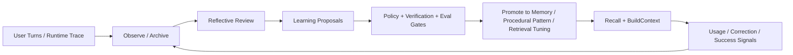

# GoodMemory 自进化记忆增强计划

> Status: Reference analysis.  
> Canonical execution roadmap has moved to `docs/GoodMemory-Unified-Self-Evolving-Roadmap.md`.  
> This document remains as Hermes/self-evolution-focused research input and design rationale.

Status: Proposed  
Date: 2026-04-07  
Scope: GoodMemory OSS Core + Optional Evolution Layer

## 1. 结论摘要

Hermes Agent 的 “self-improving” 不是运行时在线改模型参数，也不是在线 RL。

它真正做的是一组外循环：

- 用 memory 把 durable facts 持久化
- 用 skill 把可复用流程沉淀为 procedural memory
- 用 session search 检索历史会话
- 用 context compression 在长会话里保住关键上下文
- 用 trajectory export / compression 为下一代模型训练提供离线数据

这对 GoodMemory 的启发不是“把 GoodMemory 变成一个 agent framework”，而是：

> 让 GoodMemory 变成一个带有观察、反思、提案、验证、推广能力的 memory kernel。  
> 它依然是 memory layer，但会随着真实使用结果不断调整自己的写入、召回、验证和维护质量。

GoodMemory 已经具备很好的骨架：

- 稳定 taxonomy
- remember / recall / buildContext / feedback / verify / maintain 主链路
- policy hooks
- runtime vs durable 分离
- explainability 和 eval 思维

缺的不是大重构，而是闭环：

- 缺少 outcome telemetry
- 缺少 session archive + cross-session recall
- 缺少反思式 write-path
- 缺少 procedural pattern compiler
- 缺少基于真实效果的 recall/router 自调优
- 缺少 eval-gated promotion pipeline

因此，最合理的方向是：

- 保持 `createGoodMemory()` 的最小 public API 不变
- 新增一个可选的 evolution layer
- 把自进化能力放在 `remember + recall + maintenance` 之间
- 始终保持 rules-first、local-first、explainable、policy-gated

## 2. 研究拆分

本次分析按三条线并行推进：

- 线 A: 深挖 `third-party/hermes-agent-main` 的真实 self-improving 机制
- 线 B: 盘点 GoodMemory 当前代码结构与可插入点
- 线 C: 对齐 GoodMemory 现有 PRD / task-board / 约束，避免方案违背项目定位

这个分工最终得出的共同结论是：

- Hermes 值得借鉴的是 “外循环设计”
- GoodMemory 必须保留 “library-first memory layer” 的产品心智
- 自进化能力应该落在现有 Phase 12 风格的可选增强层，而不是把 v1 变成 “Memory OS”

## 3. Hermes 到底是怎么 self-improving 的

### 3.1 不是在线改模型

Hermes 运行时并不会在线更新模型权重。

它的 “越用越强” 来自系统级外循环，而不是参数级学习：

- durable memory 写入
- skills 文件创建与修补
- 历史 session 检索与总结
- 压缩前记忆抢救
- 离线 trajectory 数据集生成与压缩

这点必须说清楚，否则会把设计方向带偏。

### 3.2 Hermes 的五个真实闭环

#### A. Durable Memory Loop

Hermes 通过 prompt guidance 明确要求模型把 durable facts 存进 memory。

它的核心机制包括：

- `MEMORY.md` / `USER.md` 在 session 开始时加载，并冻结进 system prompt
- 运行中通过 `memory` tool 直接写磁盘
- 每隔 N 个 user turn 触发一次 silent background review，检查是否应写 memory
- context compression / reset / exit 前做一次 memory flush，把即将丢失的信息抢救出来

这个闭环的关键不是 “存得多”，而是：

- 强 nudging
- durable / runtime 分离
- 压缩前 salvage
- 后台 review 不打断主任务

#### B. Skill Loop

Hermes 把 procedural memory 当成显式 skill 文件，而不是只当 embedding 或摘要文本。

它的核心机制包括：

- prompt 里要求复杂任务后创建 skill
- 发现 skill 过期时立即 patch
- 记录多少轮 tool iteration 没有更新 skill
- 到阈值后在后台 fork 一个 review agent
- review agent 根据刚刚完成的对话，决定 create / update skill

这让 Hermes 的 procedural memory 具备三个特征：

- 可读
- 可版本化
- 可在未来任务中被直接调用

#### C. External Memory Provider Loop

Hermes 的 `MemoryProvider` / `MemoryManager` 把外部 memory backend 接成一个标准生命周期：

- initialize
- system prompt block
- prefetch
- sync_turn
- on_session_end
- on_pre_compress
- on_memory_write

这意味着 Hermes 的记忆并不只有内置 Markdown memory。

它支持：

- turn 前 recall
- turn 后 sync
- session 结束时 ingest
- compression 前提取信号
- built-in memory 与 external memory 的桥接

这是一个非常值得 GoodMemory 借鉴的抽象。

#### D. Session Recall Loop

Hermes 会把 session / messages 存到 SQLite，并通过 FTS5 做 cross-session 检索。

`session_search` 的逻辑不是简单返回 transcript，而是：

- FTS 检索 top sessions
- 抽取相关上下文
- 用廉价模型做 focused summarization
- 返回浓缩后的跨 session recap

这不是 “学习”，但它显著提升了 continuity。

#### E. Context Handoff Loop

Hermes 的 `ContextCompressor` 会在长会话中：

- 剪旧 tool output
- 保留 head / tail
- 把中间段压成结构化 handoff summary
- 多次压缩时迭代更新之前的 summary

再配合 compression 前 memory flush 和 provider hooks，能把即将消失的会话价值最大化保住。

这本质上是：

- continuity preservation
- salvage before loss

### 3.3 Hermes 的离线学习回路

Hermes 真正接近 “训练下一代模型” 的部分在离线链路：

- 导出 trajectory JSONL
- 用 `trajectory_compressor.py` 把长轨迹压缩成训练样本
- 用 `batch_runner.py` 和相关 environment 生成大规模 agent data
- 为未来的 tool-calling / RL / SFT 训练提供原料

所以 Hermes 的“learning loop”应该拆成两层理解：

- 在线层: memory / skills / recall / compression
- 离线层: trajectories / compression / training data

### 3.4 Hermes 值得借鉴的地方

- stable prompt snapshot 与 ephemeral recall context 分离
- pre-compression / session-end salvage hooks
- session archive + transcript search
- procedural memory 显式化，而不是只当向量
- 背景反思任务不阻塞热路径
- 离线 eval / data 产物可持续沉淀

### 3.5 Hermes 不该直接照搬的地方

- 它的 “self-improving” 有明显 prompt-driven 成分，算法 credit assignment 很弱
- background review 自动创建 skill 的风险偏高
- 部分 lifecycle wiring 看起来并不完全一致
- 它的技能文件系统强依赖 agent runtime，不适合作为 GoodMemory core 的默认形态

对 GoodMemory 来说，应该借鉴其闭环，不应照搬其表面形态。

## 4. GoodMemory 当前已经具备什么

GoodMemory 现在更像一个规整、可治理的 memory kernel。

### 已有优势

- `remember()` 已经有候选提取、分类、score、redact、policy gate、dedupe / merge / supersede
- `recall()` 已有 scope-bound recall、routing decision、context packet、verification hints、policyApplied
- `feedback()` 已是正式 procedural memory 入口
- `maintenance` 已经有 dedupe、contradiction repair、consolidation、dream gate scaffold
- `runtime` 有 working memory / session journal / spillover 基础
- `storage` / repositories / policy hooks 已经提供很好的扩展缝

### 当前缺口

- 记忆使用后的 outcome 没有回流到系统
- decay helper 没真正接入 recall
- vector hooks 已有但 recall 还没真正使用 hybrid retrieval
- session archive / session search 还不是正式能力
- derived memory 还停留在概念层
- reflective write-path 还没有
- maintenance 还不是 outcome-driven
- eval 还没有用来给策略 promotion 做强门禁

一句话：

> GoodMemory 现在具备 memory system 的静态骨架，但还没有形成 “记住 -> 用到 -> 结果反馈 -> 调整策略 -> 再次变强” 的闭环。

## 5. GoodMemory 自进化的目标定义

GoodMemory 的 “越用越强” 不应该被定义为：

- 越存越多
- 越像 Memory OS
- 越依赖某个特定 agent runtime
- 越依赖云端或重基础设施

它应该被定义为五种能力持续增强：

1. 更会记
   逐步提高 write-path 的 candidate quality、conflict handling、procedural capture 质量。

2. 更会召回
   更准确地决定本轮该召回什么，尤其是 episodic / procedural / cross-session context。

3. 更会验证
   更清楚什么该被视为 stale、什么需要 verify before act。

4. 更会维护
   能根据真实使用结果做 dedupe、decay、consolidation、contradiction repair、promotion / demotion。

5. 更会沉淀经验
   能把重复成功的模式编译成可复用 procedural memory，而不是让经验只停留在一次对话里。

## 6. 必须坚持的设计护栏

这个增强计划必须严格遵守 GoodMemory 现有定位。

### 产品护栏

- GoodMemory 仍然是 `memory layer`
- 仍然是 `user-aware context engine`
- 不把 “Memory OS” 当作默认外部定位
- 继续保持 `write -> recall -> compose -> verify -> maintain`

### API 护栏

- 不急着扩张 `createGoodMemory()` 的 public config
- `storage` 仍应是唯一必需运行时配置
- 自进化能力先以内核可选层存在
- 先扩内部 `EngineConfig` / advanced module，再考虑 public surface

### 架构护栏

- rules-first
- local-first
- deterministic fallback 必须存在
- no mandatory queue
- no mandatory cloud
- no mandatory graph infra

### 治理护栏

- 每条 learned behavior 都要有 provenance
- 每次 promotion 都要 explainable
- policy hooks 仍然在 model output 之前
- `ignoreMemory`、scope guard、多租户边界不能被学习逻辑绕开
- 不持久化可从权威来源重新推导的信息

### 上线护栏

- 新策略先 observe，再 assist，再 promote
- 所有 promotion 都必须经过 eval gate
- 不允许 silent auto-create durable memory / procedural artifact 而没有 hard rules

## 7. 目标架构

这个架构的核心不是让 GoodMemory “自动乱学”，而是：

- 观察真实交互
- 形成结构化提案
- 经过 policy / verify / eval gate
- 再推广到未来 recall / remember / maintain 行为

### 7.1 推荐的模块落位

建议新建一个内部 top-level namespace: `src/evolution/`

理由：

- `maintenance/` 更适合 hygiene jobs
- `remember/` / `recall/` 继续保持主链路清晰
- `evolution/` 可以承载观察、反思、提案、推广，不污染现有心智

同时对现有目录做小幅扩展。

| Area | Proposed Modules | Responsibility |
| --- | --- | --- |
| `src/evolution/` | `signals.ts`, `archive.ts`, `reviewer.ts`, `proposals.ts`, `promotion.ts` | 观察、归档、反思、提案、推广 |
| `src/remember/` | `assistedExtractor.ts`, `reviewCompiler.ts` | 可选 LLM-assisted extraction 与反思编译 |
| `src/recall/` | `hybridEngine.ts`, `sessionSearch.ts`, `strategies.ts` | hybrid retrieval、cross-session recall、router strategy |
| `src/maintenance/` | `outcomeLearning.ts`, `reinforcement.ts` | 用 outcome 信号驱动 maintenance 和质量调整 |
| `src/domain/` | `learning.ts`, `insights.ts` | experience records、learning proposal、derived memory types |
| `src/storage/` | `experience` / `archive` contracts + repositories 扩展 | 持久化 interaction trace、session archive、learning artifacts |
| `src/eval/` | `continuous.ts`, `promotionGate.ts` | shadow mode、A/B、promotion gate |

### 7.2 建议新增的数据产物

#### ExperienceRecord

记录一次记忆相关交互的真实结果。

建议字段：

- scope
- sessionId
- query
- retrieved memory ids
- buildContext output summary
- verification hints
- answer outcome
- user correction / confirmation
- recall hit usefulness
- timestamps

#### SessionArchive

不是把所有运行时消息都塞进 durable memory，而是建立可搜索的 session archive。

建议存：

- normalized transcript
- summarized transcript
- key decisions
- unresolved loops
- referenced artifacts
- lineage

#### LearningProposal

所有 “学到的东西” 先是提案，不直接变成 durable memory。

提案类型可包括：

- `memory_write`
- `memory_revision`
- `procedural_pattern`
- `recall_weight_adjustment`
- `maintenance_action`
- `verification_rule`

#### PromotionRecord

记录一次提案为什么被接受、拒绝或延迟。

这对 explainability 和 eval gate 很关键。

## 8. GoodMemory 应该新增的五个闭环

### 8.1 Post-Turn Reflective Review Loop

这是 Hermes background review 的 GoodMemory 版本，但要更安全。

#### 目标

- turn 完成后异步回看本轮对话与 trace
- 判断是否形成 durable memory / procedural pattern / memory revision proposal
- 不直接写入，先产出 `LearningProposal`

#### 建议流程

1. `remember()` / `recall()` / `feedback()` 产生 trace
2. `evolution/reviewer.ts` 读取 conversation + trace + runtime summary
3. 产出结构化 proposal
4. 经过 `policy` + `scope guard` + `conflict resolution`
5. 进入 `promotion` 或 `human-review / delayed-review`

#### 为什么比 Hermes 更适合 GoodMemory

- Hermes 直接 background create skill 风险较高
- GoodMemory 应该先形成 proposal，再决定是否 promotion
- 这样更符合 explainability-first 与 governance-first

### 8.2 Pre-Compression / Session-End Salvage Loop

这是最值得从 Hermes 迁移的一环。

#### 目标

- 在 runtime context 被压缩或结束前，抢救高价值信号

#### 应抢救的内容

- unresolved loops
- corrective feedback
- repeated failure / retry pattern
- key decisions
- durable references
- candidate procedural patterns

#### 建议接口

- `onPreCompact(scope, runtimeState, trace)`
- `onSessionEnd(scope, archive, trace)`

#### 预期产物

- new episode candidate
- procedural pattern proposal
- stale fact verification proposal
- session archive summary

### 8.3 Cross-Session Recall Loop

GoodMemory 现在有 episodic memory，但还没有像 Hermes 那样的 session archive 检索能力。

#### 目标

- 让 GoodMemory 能检索 “上次发生了什么”
- 不要求把所有 transcript 原样注入模型
- 支持 lexical-first，后续可选 semantic / summarization

#### 建议阶段

- 第一阶段: SQLite / Postgres 上的 searchable session archive
- 第二阶段: top sessions + focused summarization
- 第三阶段: hybrid archive recall + episodic merge

#### 关键原则

- archive 是 recall substrate，不等于 durable fact store
- archive recall 的输出要 explainable
- 当前 session 与当前 lineage 要正确排除或降权

### 8.4 Procedural Pattern Compiler

这是 GoodMemory 从 “会记事” 走向 “会沉淀做法” 的关键。

Hermes 的做法是写 skill 文件。GoodMemory 不应默认绑定 skill file system。

#### 推荐做法

近阶段：

- 复用现有 `FeedbackMemory.kind = "validated_pattern"`
- 把重复成功的 correction / workflow / style pattern 编译成 procedural memory

中阶段：

- 新增 richer `PlaybookMemory` 或 `ProcedureArtifact`
- 允许 adapter 层导出成 Hermes / Claude Code / Codex 风格 skill artifacts

#### 为什么不直接照搬 Hermes 技能系统

- GoodMemory 是 framework-neutral memory layer
- procedural memory 是核心，skill file format 只是某种 adapter
- core 应保存 “可验证的 procedural pattern”，而不是绑死某个 runtime 的文件布局

### 8.5 Outcome-Driven Maintenance Loop

当前 maintenance 还是 heuristic hygiene。

未来应该加入 outcome-driven learning：

- recall 被实际用到时，提高 evidence / usage signal
- recall 误导行动时，触发 demotion / verify bias
- repeated correction 触发 supersede / contradiction repair
- validated pattern 提高 procedural priority
- stale but repeatedly successful 的 memory 可获得 resilience

#### 这意味着要扩展 repository mutation API

建议新增：

- `facts.touch()`
- `facts.reinforce()`
- `feedback.markUsed()`
- `feedback.reinforce()`
- `episodes.archive()`
- `insights.upsert()`

不要让所有变更都退回 raw store set/delete。

## 9. GoodMemory 不该直接照搬 Hermes 的点

### 不照搬 1: silent auto-create

Hermes 的 background review 可以直接写 memory / skills。

GoodMemory 不应默认允许这一点。

更好的模式是：

- background reviewer 生成 proposal
- promotion 经过 hard rules
- 高风险类型支持 review queue 或 delayed activation

### 不照搬 2: skill files 作为 core procedural model

GoodMemory 应该：

- 把 procedural memory 抽象成一等概念
- 把 skill file export 放在 adapter 层

### 不照搬 3: “self-improving” 的宽泛宣传

GoodMemory 的文档应该更精确：

- 在线不是模型训练
- 在线是记忆质量、召回质量、procedural quality 的持续改进
- 离线才可能产生新的训练数据与模型蒸馏产物

## 10. 分阶段落地计划

这个计划应映射到现有 task-board，优先复用 Phase 12 的方向，而不是另开一条平行大路线。

### Phase 1: Observation Plane

目标：

- 先让系统能观察自己，再谈自进化

交付：

- `ExperienceRecord`
- `SessionArchive`
- `LearningProposal`
- recall / remember / feedback / verify trace 标准化
- 持久化 proposal / promotion log

建议实现：

- `src/domain/learning.ts`
- `src/evolution/signals.ts`
- `src/evolution/archive.ts`
- `src/storage` 扩展 archive / experience repository

验收：

- 每次 recall/remember 都能留下 inspectable learning trace
- 不改变现有 public API
- deterministic tests 覆盖 archive / proposal generation

### Phase 2: Session Archive + Hybrid Recall

目标：

- 补齐 cross-session continuity

交付：

- searchable session archive
- `recall/sessionSearch.ts`
- archive recall explainability
- optional hybrid episode + archive merge

建议实现：

- lexical-first
- optional semantic later
- current lineage exclusion

验收：

- “continue / resume / from last time” 类 query 在 eval 里明显提升
- 不需要 live model 时也能 rules-only 回退

### Phase 3: Reflective Write Path

目标：

- 让系统能从对话和 outcome 中形成结构化学习提案

交付：

- `remember/assistedExtractor.ts`
- `evolution/reviewer.ts`
- pre-compression salvage
- session-end salvage
- proposal -> policy -> promotion 流程

建议实现：

- rules-only extractor 继续作为 baseline
- assisted extractor 默认关闭
- 所有 LLM influence 都记录 provenance

验收：

- candidate-level trace 能区分 `rules-only` vs `assisted`
- policy hooks 仍在 model output 前生效
- 新能力可被 eval 对比

### Phase 4: Procedural Pattern Compiler

目标：

- 把 repeated corrections / successful workflows 变成可复用 procedural memory

交付：

- `validated_pattern` 编译器
- procedural promotion logic
- optional adapter export interface

建议实现：

- 先复用 `FeedbackMemory`
- 后续再考虑 richer playbook artifact

验收：

- repeated corrections rate 下降
- procedural reuse rate 上升
- coding_agent 场景 continuity 提升

### Phase 5: Outcome-Driven Maintenance

目标：

- maintenance 不只做清洁，还要做 quality adaptation

交付：

- usage reinforcement
- verify-driven demotion
- outcome-aware contradiction repair
- recall score tuning inputs

建议实现：

- 把 `decay` 真正接入 recall scoring
- 把 `accessCount / lastUsedAt / evidenceCount` 用起来
- 把 maintenance 变成 “heuristic + outcome signal” 混合系统

验收：

- stale/incorrect memory 的误召回下降
- verified memories 的长期稳定性提升

### Phase 6: Eval-Gated Promotion

目标：

- 自进化必须是可证明的，而不是自我感觉更强

交付：

- `observe -> assist -> promote` 模式
- shadow evaluation
- strategy comparison
- promotion gate
- regression dashboard artifacts

建议实现：

- 新策略先 shadow
- 达到阈值后才能 promote
- 保留 mode 标签和 contamination-safe trace

验收：

- 对 persona / scenario eval 有可测提升
- 不破坏 rules-only baseline
- release checklist 可纳入新的 promotion gate

## 11. 推荐的最小实现切片

如果只做一个最小但正确的切片，我建议按这个顺序：

1. 建 `ExperienceRecord` + `LearningProposal`
2. 把 `remember/recall/feedback/verify` 的 trace 标准化
3. 加 `SessionArchive` 和 `sessionSearch`
4. 做 pre-compression / session-end salvage
5. 做 `assistedExtractor`，但默认关闭
6. 把 proposal promotion 接进 eval gate

原因：

- 先有 observation plane，后面所有学习闭环才有抓手
- 先补 archive recall，continuity 提升最直接
- 先做 proposal system，能避免自进化逻辑直接污染 durable memory

## 12. 成功指标

建议把 “越用越强” 量化成以下指标：

- repeated correction rate 下降
- history continuation score 提升
- task continuation score 提升
- procedural reuse rate 提升
- verified-action precision 提升
- stale memory misuse rate 下降
- recall usefulness per source 提升
- maintenance completion rate 与 maintenance win rate 可度量

这些指标都应能映射到现有 eval / trace 体系。

## 13. 推荐的 public surface 策略

短期不要把自进化能力直接塞进 `GoodMemoryConfig` 主入口。

推荐路线：

- 先作为 internal / advanced module 落地
- 等 observe / assist / promote 三种模式都跑通
- 再决定是否暴露成：
  - `goodmemory/evolution`
  - 或 `createGoodMemory({ advanced: { evolution: ... } })`

在那之前：

- `createGoodMemory()` 保持克制
- `storage` 继续是唯一 required runtime config
- provider-backed behavior 始终可选

## 14. 对应的源码方向

### Hermes 关键证据点

- `third-party/hermes-agent-main/agent/prompt_builder.py`
- `third-party/hermes-agent-main/run_agent.py`
- `third-party/hermes-agent-main/tools/memory_tool.py`
- `third-party/hermes-agent-main/tools/skill_manager_tool.py`
- `third-party/hermes-agent-main/tools/session_search_tool.py`
- `third-party/hermes-agent-main/agent/memory_provider.py`
- `third-party/hermes-agent-main/agent/memory_manager.py`
- `third-party/hermes-agent-main/agent/context_compressor.py`
- `third-party/hermes-agent-main/agent/trajectory.py`
- `third-party/hermes-agent-main/trajectory_compressor.py`

### GoodMemory 当前可插入点

- `src/index.ts`
- `src/remember/engine.ts`
- `src/remember/deterministicExtractor.ts`
- `src/recall/engine.ts`
- `src/recall/router.ts`
- `src/runtime/contextService.ts`
- `src/maintenance/runner.ts`
- `src/maintenance/decay.ts`
- `src/maintenance/dream.ts`
- `src/storage/repositories.ts`
- `src/policy/hooks.ts`

## 15. 最终建议

GoodMemory 的正确方向不是变成 Hermes 的克隆。

正确方向是：

- 借鉴 Hermes 的外循环设计
- 保留 GoodMemory 的 library-first、rules-first、explainable、governed 架构优势
- 让 memory layer 从 “静态可用” 演进到 “可观察、可反思、可验证、可推广”

最终形态应该是：

> GoodMemory 不是一个会自动乱学的 memory feature。  
> GoodMemory 是一个可以在真实交互中持续编译经验、验证经验、推广经验的自进化记忆层。
