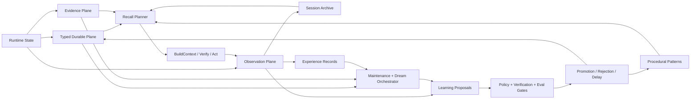

# GoodMemory 统一自进化 Roadmap

Status: Proposed Canonical Roadmap  
Date: 2026-04-07  
Scope: GoodMemory OSS Core + Optional Evolution Layer  
Supersedes:
- `docs/GoodMemory-MemPalace-对标分析与自进化增强计划.md`
- `docs/GoodMemory-Self-Evolving-Memory-Enhancement-Plan.md`

## 1. 这份文档解决什么问题

这份文档的目的，不是引入第三条平行路线，而是把现有两份自进化计划合并成一份可执行、可对齐 task-board、不会留下结构性技术债务的统一 roadmap。

自本文件起：

- 上述两份原文档保留为研究输入和设计来源，不再作为并行执行路线。
- 本文是唯一的“执行顺序 + 边界裁决 + 模块归属 + 成功标准”文档。
- 现有 `task-board`、`ADR-002`、`ADR-004` 是本文必须对齐的实现约束，不另起炉灶。
- `docs/GoodMemory-记忆数据分层设计.md` 可以作为兼容的分层与存储参考，但不得覆盖本文对执行顺序和模块归属的裁决。

## 2. 原文档各自贡献了什么

### 2.1 MemPalace 对标文档贡献

`GoodMemory-MemPalace-对标分析与自进化增强计划.md` 的核心价值是提出了这些正确方向：

- evidence-first，而不是写入时过早压缩
- layered recall，而不是只靠单层检索
- dream / reflection / benchmark-driven iteration 的系统视角
- compact view 必须是 projection，而不是 source of truth

它更擅长回答：

- 为什么 GoodMemory 需要 evidence plane
- 为什么 recall 必须分层
- 为什么 dream 不能只是 gate

### 2.2 Self-Evolving 文档贡献

`GoodMemory-Self-Evolving-Memory-Enhancement-Plan.md` 的核心价值是补齐了外循环闭环：

- observation plane
- session archive + cross-session recall
- LearningProposal / PromotionRecord
- procedural pattern compiler
- outcome-driven maintenance
- observe -> assist -> promote 的上线策略

它更擅长回答：

- 系统到底学什么
- 学到的东西先落在哪一层
- 什么能 promotion，什么只能提案

### 2.3 本文如何吸收两者

统一后的判断是：

- 用 MemPalace 文档提供的 `evidence-first + layered recall + dream/compiler` 结构能力
- 用 Self-Evolving 文档提供的 `observe + archive + proposal + promotion` 治理闭环
- 保持 GoodMemory 的 `library-first`、`rules-first`、`policy-gated`、`eval-gated` 定位不变

## 3. 统一后的总原则

### 3.1 产品定位不变

GoodMemory 仍然是：

- `memory layer`
- `user-aware context engine`
- `library-first OSS core`

GoodMemory 不是：

- full chat history database
- Memory OS
- 绑定某个 agent runtime 的 skill framework

### 3.2 API 护栏不变

- `createGoodMemory()` 继续保持克制
- `storage` 仍然是唯一必需运行时配置
- provider-backed / evolution-backed 能力全部可选
- public surface 只有在行为稳定且通过 eval gate 后才扩展

### 3.3 架构护栏不变

- rules-first
- local-first
- deterministic fallback required
- no mandatory queue
- no mandatory cloud
- no mandatory graph infra

### 3.4 治理护栏不变

- 每条 learned behavior 都必须有 provenance
- 每次 promotion 都必须 explainable
- policy hooks 仍然在 model output 之前生效
- `ignoreMemory`、scope guard、多租户边界不能被学习逻辑绕过
- 不持久化可从权威来源廉价重建的信息
- 不允许 silent auto-create durable memory / procedural artifact 而没有 hard rules

## 4. 关键冲突的统一裁决

本节是合并后的正式裁决，用来消除原两份文档之间的软冲突。

### 4.1 检索顺序裁决

统一后的顺序是：

1. 先补 `observation + archive + trace`
2. 再补 `session archive recall`
3. 再补 `evidence recall`
4. 最后接入 provider-backed hybrid retrieval 与 optional rerank

原因：

- continuity 的直接收益来自 archive recall
- explainability 的基础来自 trace 和 archive，不依赖 embedding
- embeddings / hybrid retrieval 应复用现有 Phase 12 provider abstraction，不另起路线

### 4.2 数据边界裁决

以下五类数据必须严格区分，不能混用。

| Artifact | Canonical Role | Feeds | Must Not Become |
| --- | --- | --- | --- |
| `TypedMemory` | GoodMemory 的主治理面，保存稳定、可控、可导出的 durable signal | recall, buildContext, verification, maintenance | verbatim transcript dump |
| `EvidenceRecord` | 与 typed memory 或 proposal 绑定的选择性证据切片 | explainable recall, rerank, why/backing, verification | 全量聊天历史 |
| `SessionArchive` | 可搜索的 cross-session continuity substrate | resume/continue recall, salvage, session summarization | durable fact store |
| `ExperienceRecord` | 记忆系统的使用与结果遥测 | maintenance tuning, eval, promotion gate | 用户可见 durable memory |
| `LearningProposal` | 所有“学到的东西”的候选层 | policy, verification, eval, promotion | 已激活的 memory 或策略 |
| `PromotionRecord` | 提案的接受/拒绝/延迟审计日志 | governance, release gate, rollback | recall corpus |

统一要求：

- `EvidenceRecord` 只存选择性 shard，不存整段 session transcript。
- `SessionArchive` 可以保存 normalized transcript 和 summarized transcript，但它不参与事实真值定义。
- `ExperienceRecord` 是 append-only outcome telemetry，不进入用户直接 recall。
- `LearningProposal` 是唯一合法的“后台学到东西”的落点；后台任务不能直接把高风险结果写成 durable memory。

### 4.3 现有字段的演进裁决

为避免 schema 技术债，统一按以下方式演进：

- 现有 `evidenceCount` 保留，作为 typed memory 上的派生统计字段
- `FeedbackMemory.evidence` 未来只保存 evidence id 或压缩引用，不保存 verbatim blob
- verbatim 内容统一放到 `EvidenceRecord`
- 不新增第二套“轻量 evidence 文本”平行字段

### 4.4 模块归属裁决

统一后的模块边界如下：

| Area | Canonical Responsibility |
| --- | --- |
| `src/evidence/` | `EvidenceRecord` 的 schema、link、写入、读取、检索、可选向量化 |
| `src/evolution/` | `ExperienceRecord`、`SessionArchive`、`LearningProposal`、`PromotionRecord`、reviewer、promotion、salvage |
| `src/remember/` | deterministic extractor、optional assisted extractor、write-path integration |
| `src/recall/` | planner、session archive recall、evidence recall、fusion、explainability |
| `src/maintenance/` | decay、dedupe、contradiction、consolidation、outcome-aware maintenance、dream entrypoint |
| `src/eval/` | miss taxonomy、shadow compare、promotion gate、regression artifacts |

明确裁决：

- 不新增 `src/reflection/` 顶层目录，reflection 归入 `src/evolution/`
- `src/maintenance/dream.ts` 继续是 gate + background orchestration entrypoint
- 真正的 review/compiler/proposal 逻辑放进 `src/evolution/`

这样既保留现有 `maintenance` 心智，又避免 dream / reflection / evolution 三套概念并存。

### 4.5 procedural memory 建模裁决

统一后的近中期方案：

- 近阶段 procedural memory 继续复用 `FeedbackMemory.kind = "validated_pattern"`
- 通过 `userId / workspaceId / agentId / appliesTo` 表达适用范围
- 不在当前 roadmap 中新增 `AgentProcedureMemory`、`TaskPatternMemory` 作为 core durable type
- 如果后续确实需要 richer artifact，再新增 `ProcedureArtifact` 作为 derived / export-friendly 表达

原因：

- 先复用现有 taxonomy，避免引入新的 durable type 迁移成本
- procedural 的核心是 promotion 和 reuse，不是立刻扩 memory taxonomy
- skill file export 只能存在于 adapter 层，不能反向定义 core schema

### 4.6 graph / compact view 裁决

- `GoodMemory Compact View` 可以做，但只允许作为 projection
- topic graph 不进入 core committed roadmap
- 如需 graph，只能作为 optional experiment 或 provider-backed projection

这样可以保留扩展空间，但不把 `graph infra` 变成架构债务。

## 5. 统一后的目标架构

### 5.1 统一后的 recall 分层

统一后的 recall stack 为：

- `L0 Policy / Identity`
  - 身份、强约束、ignoreMemory、scope guard、关键 procedural constraints
- `L1 Typed Durable Working Set`
  - profile、stable preferences、references、stable facts、validated patterns
- `L2 Active Session Continuity`
  - working memory、session journal、open loops、current session episodic continuity
- `L3 Session Archive Recall`
  - cross-session searchable archive，用于回答 “上次做到哪了”
- `L4 Evidence Recall`
  - 与 typed memory / proposals 关联的 evidence shard，用于 why、tradeoff、failure context
- `L5 Verification / Authority`
  - 当 recall 将驱动动作时，优先读取 authority source 或触发 lightweight re-check

统一要求：

- planner 先决定开哪些层，再做候选与 fusion
- lexical-first 必须始终存在
- semantic / embedding / rerank 是 optional enhancement，不是默认前提

## 6. 统一后的工程数据模型

### 6.1 最小新增产物

本 roadmap 的最小新增数据产物只有五类：

- `EvidenceRecord`
- `ExperienceRecord`
- `SessionArchive`
- `LearningProposal`
- `PromotionRecord`

除了这五类，不新增平行概念层。

### 6.2 `EvidenceRecord` 的准入规则

只有以下内容允许进入 evidence plane：

- 支撑已写入 typed memory 的原文证据
- 支撑 verification 或 supersede 的关键证据
- repeated correction / failure 的代表性证据
- 需要用于 recall explainability 的高价值 tool result excerpt

以下内容默认不进入 evidence plane：

- 全量 transcript
- 大体量 tool output 原文
- 可从 authority source 低成本重取的普通检索结果

### 6.3 `SessionArchive` 的准入规则

`SessionArchive` 是 continuity substrate，不是事实库。它应保存：

- normalized transcript
- summarized transcript
- key decisions
- unresolved loops
- referenced artifacts
- lineage

但它不应该：

- 代替 episode/fact/reference 成为 durable truth source
- 直接绕过 recall planner 把整段会话注入上下文

### 6.4 `LearningProposal` 的类型范围

允许的 proposal 类型：

- `memory_write`
- `memory_revision`
- `procedural_pattern`
- `maintenance_action`
- `recall_weight_adjustment`
- `verification_rule`

不允许的 proposal 类型：

- 未经 policy / eval gate 直接生效的 durable mutation
- 绕过 scope guard 的跨租户写入

## 7. 与现有 task-board 的对齐方式

这份 roadmap 不重写现有 task-board 编号，而是吸收它。

### 7.1 已存在但必须复用的基础

- `Phase 8`: maintenance scaffold 已存在，dream 目前只有 gate
- `Phase 12`: provider layer、embedding、router、hybrid retrieval、LLM-assisted write-path 是既有路线
- `Phase 13`: governance 与 memory control 已定义为核心护栏

### 7.2 对齐原则

- 不重复定义新的 provider abstraction
- 不重复定义新的 governance gate
- 不在 docs 中另起一条 “Phase 1~6” 与 task-board 并行
- 统一使用 “Roadmap Wave” 表达新增执行顺序

## 8. 统一后的执行路线

### Wave 0: 清理执行口径

目标：

- 在开始实现前消除文档歧义

交付：

- 以本文作为唯一 canonical roadmap
- 原两份文档降级为 reference analysis
- 后续 task-board 子任务全部引用本文的数据边界与模块归属

完成标志：

- 不再存在三份同时像主路线的自进化计划文档

### Wave 1: Observation + Evidence Foundation

目标：

- 先让系统能观察自己，并建立选择性 evidence substrate

交付：

- `EvidenceRecord`
- `ExperienceRecord`
- `LearningProposal`
- `PromotionRecord`
- `remember / recall / feedback / verify / maintain` trace 标准化
- `src/storage` 扩展 evidence / experience / proposal / promotion contracts

实现要求：

- rules-only 可运行
- 不改变现有 public API
- evidence write 必须 selective，不得退化成 transcript dump
- deterministic tests 覆盖新增 repo 与 trace schema

完成标志：

- 每次 remember/recall/verify 都有 inspectable trace
- typed memory 能链接到 evidence，但 evidence 不膨胀为历史数据库

### Wave 2: Session Archive + Continuity Recall

目标：

- 先解决 “continue / resume / from last time” 类 continuity 问题

交付：

- `SessionArchive`
- `onPreCompact(scope, runtimeState, trace)`
- `onSessionEnd(scope, archive, trace)`
- `src/recall/sessionSearch.ts`
- `L3 Session Archive Recall`

实现要求：

- lexical-first
- current session / current lineage exclusion or down-rank
- archive recall explainable
- optional summarization 只能作为离线或后台增强，不能成为热路径前提

完成标志：

- continuity 类 eval 切片明显提升
- 不依赖 live model 仍可 rules-only 回退

### Wave 3: Hybrid Retrieval over Evidence and Archive

目标：

- 在 continuity 和 trace 基础上接入真正的 explainable hybrid retrieval

交付：

- 复用 Phase 12 的 provider / embedding abstraction
- evidence + episodes + archive summary 的可选向量索引
- `src/recall` layer planner + fusion trace
- `L4 Evidence Recall`
- optional rerank

实现要求：

- lexical-first 继续是 baseline
- semantic / rerank 默认为 off 或 adaptive
- 所有 boost 必须带 trace 与 eval attribution
- 不允许靠“注入更多内容”换取分数

完成标志：

- targeted eval slice 中 recall quality 提升
- token 使用受控
- provider-backed 路线没有引入第二套 recall pipeline

### Wave 4: Reflective Review + Salvage

目标：

- 把对话、结果和维护信号编译成结构化 proposal，而不是后台直接落 memory

交付：

- `src/evolution/reviewer.ts`
- post-turn reflective review
- pre-compression salvage
- session-end salvage
- proposal -> policy -> verification -> eval -> promotion pipeline

实现要求：

- rules-only reviewer baseline 必须存在
- optional assisted reviewer 默认关闭
- 所有 model influence 记录 provenance
- 高风险 proposal 默认 delayed 或 review-required

完成标志：

- 系统能稳定产出 proposal，而不是直接改 durable state
- replay / trace 能解释 proposal 的来源、依据、门禁结果

### Wave 5: Procedural Pattern Promotion + Outcome-Driven Maintenance

目标：

- 让 GoodMemory 从“会记事”进化到“会沉淀做法”，同时让 maintenance 真正吃 outcome signal

交付：

- `validated_pattern` compiler
- `facts.touch()` / `facts.reinforce()` 风格的 mutation API 扩展
- verify-driven demotion
- repeated-correction-driven supersede / contradiction repair
- `accessCount / lastUsedAt / evidenceCount` 真正接入 recall scoring
- `src/maintenance/dream.ts` 作为 gate + orchestration，批量驱动 hygiene + proposal compilation

实现要求：

- procedural memory 先复用现有 `FeedbackMemory`
- dream 不直接写高风险 durable mutation
- outcome-aware maintenance 只能通过 proposal 或显式低风险规则改状态

完成标志：

- repeated correction rate 下降
- stale / incorrect memory 的误召回下降
- validated pattern 的复用率上升

### Wave 6: Eval-Gated Promotion + Public Surface Decision

目标：

- 让“越用越强”变成可证实的工程能力，而不是营销措辞

交付：

- `observe -> assist -> promote` 三阶段模式
- shadow evaluation
- strategy comparison
- promotion gate
- regression dashboard artifacts
- release checklist 更新

实现要求：

- 新策略先 shadow，再 assist，最后 promote
- promotion 必须过 eval gate
- 保留 contamination-safe trace
- 未通过 gate 的能力不得进入默认行为

完成标志：

- persona / scenario eval 有稳定增益
- rules-only baseline 不退化
- 是否公开 `goodmemory/evolution` 或 advanced config 有客观依据

## 9. 明确不做什么

为了不留下结构性技术债，以下内容明确不进入本 roadmap 的 committed scope：

- 不把 full transcript 存进 evidence plane
- 不新增 `src/reflection/` 平行目录
- 不在 core 引入 mandatory graph infra
- 不把 skill file format 作为 procedural memory 的 truth source
- 不默认启用 llm-only router
- 不让后台 reviewer 直接写高风险 durable memory
- 不再维护一套与 task-board 编号无关的平行 phase 命名

## 10. 成功指标

统一后的成功指标如下：

- repeated correction rate 下降
- history continuation score 提升
- task continuation score 提升
- evidence-backed recall usefulness 提升
- stale memory misuse rate 下降
- verified-action precision 提升
- procedural reuse rate 提升
- targeted eval uplift 稳定
- promoted strategy survival rate 可跟踪

## 11. 最终判断

统一后的路线不是：

- 复制 MemPalace
- 复制 Hermes
- 把 GoodMemory 改造成另一个 agent runtime

统一后的路线是：

> 用 GoodMemory 现有的 typed / governed / evaluable 骨架，  
> 加上 selective evidence、session archive、proposal-driven evolution、outcome-aware maintenance、eval-gated promotion，  
> 把它推进成一个真正可观察、可反思、可验证、可推广的自进化 memory layer。

从现在开始，关于自进化的实现顺序、数据边界、模块归属和推广门禁，以本文件为准。
