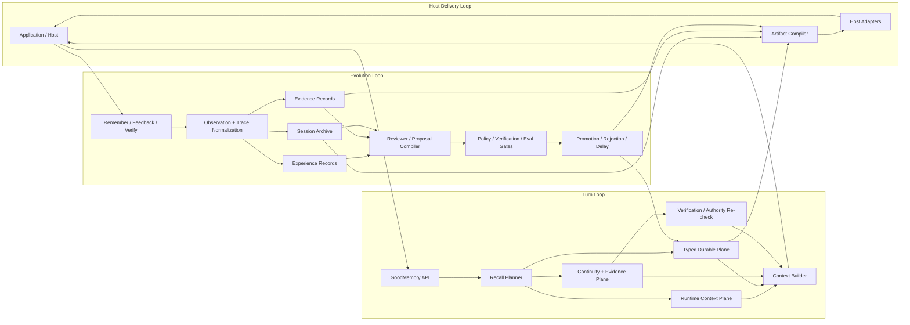

# GoodMemory OSS v2 架构方案

> 从“可用的记忆内核”推进到“可观察、可演进、可集成的 memory fabric”。

**Version:** v2-proposal  
**Date:** 2026-04-15  
**Status:** Proposed  
**Audience:** OSS maintainers, SDK integrators, AI product teams, agent runtime authors

**Primary Inputs**

- `docs/GoodMemory-OSS-Architecture-v1.md`
- `docs/archive/design-inputs/claude-GoodMemory-Architecture-v0.1.md`
- `docs/GoodMemory-First-Principles-and-Reference-Architecture.md`
- `docs/GoodMemory-Unified-Self-Evolving-Roadmap.md`
- `task-board/00-README.txt`
- `docs/GoodMemory-v1-Quality-Gate.md`

---

## 1. 为什么现在需要 v2 文档

截至 **2026-04-15**，GoodMemory 已经不再是一个“只有 v1 草图”的项目。

- `docs/GoodMemory-v1-Quality-Gate.md` 显示，**2026-04-08** 的本地质量门已经覆盖 `bun test`、`bun run test:coverage`、`bun run typecheck`、CLI、example、eval smoke 与 fallback。
- `src/` 已经不只有 `remember / recall / storage / runtime`，还出现了 `evidence / evolution / governance / provider` 等目录，说明全景骨架里的很多能力已经进入实现层。
- `task-board/00-README.txt` 明确当前执行焦点已经进入 **Phase 16 procedural promotion and outcome-aware maintenance**，后续还要进入 **Phase 17 strategy rollout** 与 **Phase 18 host adapters**。

这意味着：

1. `v1` 文档已经更像“可落地的 OSS 核心架构”。
2. `claude v0.1` 文档仍然有价值，但它更像“全景骨架”，不是当前代码库的精确执行图。
3. 现在缺的不是另一份平行 roadmap，而是一份把两者收束到一起的 **v2 目标架构文档**。

这份文档的任务就是：

> 在不推翻 v1 已完成工作的前提下，把 GoodMemory 下一阶段统一定义为一个双环闭环、evidence-backed、host-aware、仍然 library-first 的 v2 架构。

---

## 2. v2 的核心判断

### 2.1 v2 不是重写，而是收束

v2 不应该把 GoodMemory 从头设计一遍。

v2 的正确方向是：

- 保留 v1 已经验证过的 API 克制和模块边界
- 吸收 `claude v0.1` 的全景系统视角
- 用统一后的自进化 roadmap 把 evidence、archive、proposal、promotion、host adapter 串成一个完整闭环

### 2.2 v2 仍然不是这些东西

GoodMemory v2 仍然不是：

- agent framework
- transcript database
- vector database wrapper
- chat history SaaS
- vendor-specific memory feature 封装层

它仍然是：

> 一个独立的、可插拔的、可治理的、对 AI 应用负责 continuity 的 memory layer。

### 2.3 v2 的本质升级

v1 主要解决的是：

- 能记
- 能取
- 能解释
- 能评测

v2 要进一步解决的是：

- 如何把“记忆证据”与“记忆真值”分开
- 如何让系统从结果中学习，但不绕过治理
- 如何把 procedural reuse 变成可推广能力
- 如何让 Claude/Codex 一类 host 消费 GoodMemory 的编译产物，但又不反向定义真值

因此，v2 的本质不是“更多 memory type”，而是：

> 从单次 recall/remember 闭环，升级为 **turn loop + evolution loop + host delivery loop** 三环协同。

---

## 3. v2 设计原则

### P1. Library-first 不变

- 默认接入仍然是 `createGoodMemory()`
- 默认本地开发仍然不需要云控制面
- 默认 rules-first 路径必须能跑通

### P2. Typed durable memory 仍然是 canonical truth

以下内容可以增强 typed memory，但不能替代它：

- evidence
- session archive
- experience telemetry
- learning proposals
- host artifact exports

### P3. 学习必须先落 proposal，再决定是否晋升

后台任务不能直接把高风险结论写进 durable memory。

统一规则：

- 先 observation
- 再 proposal
- 再 policy / verification / eval gate
- 最后 promotion / rejection / delay

### P4. Retrieval 先分层，再融合

v2 不再把 recall 理解成“对一个 memory store 做搜索”。

v2 的 recall 必须先决定：

- 当前 turn 需要哪些层
- 每层开多大预算
- 哪些内容只作解释，不作 prompt 注入
- 哪些内容在驱动动作前必须重新验证

### P5. Host integration 只能消费编译产物，不能反向定义真值

像 Claude Code / Codex 这种 host 需要：

- session continuity
- file-authoritative re-check
- procedure artifact export
- handoff / resume

但 host 文件、skill 文件、playbook 文件都只能是 **projection / delivery artifact**，不能成为 core truth source。

### P6. 任何增强都必须可回退、可比较、可归因

provider-backed recall、assisted extraction、reviewer、rerank、promotion 都必须满足：

- 有 rules-only baseline
- 有 trace
- 有 targeted eval slice
- 有 rollback 路径

---

## 4. v2 现状快照与架构机会

当前仓库已经具备 v2 的部分地基：

| 现状 | 仓库证据 | 对 v2 的含义 |
| --- | --- | --- |
| 核心 API 已稳定 | `src/api/`, `src/index.ts` | v2 不应轻易打破根接口 |
| recall / remember / runtime / verify 已成链 | `src/recall/`, `src/remember/`, `src/runtime/`, `src/verify/` | turn loop 已存在 |
| evidence / evolution / governance 已存在 | `src/evidence/`, `src/evolution/`, `src/governance/` | evolution loop 已经开始落地 |
| provider layer 已存在 | `src/provider/`, `src/embedding/` | 高阶 retrieval 与 assisted path 可以通过现有抽象增强 |
| task-board 已推进到 16-18 phase | `task-board/00-README.txt` | v2 的近期工作不该脱离当前执行顺序 |

所以 v2 不是 greenfield 架构。

更准确地说：

> v2 是把当前已经分散出现的能力，提升成一个有明确平面分工、闭环边界、交付顺序和公共接口策略的统一系统。

---

## 5. v2 总体架构



这个图对应三个闭环：

1. **Turn Loop**
   解决“这轮该带什么上下文进模型”。
2. **Evolution Loop**
   解决“系统从使用结果中学到什么，如何安全进入 durable state”。
3. **Host Delivery Loop**
   解决“如何把 GoodMemory 的治理结果投影给具体 host/runtime 消费”。

---

## 6. 六大平面

v2 推荐把架构稳定为六个平面，而不是继续只讨论 memory type。

### 6.1 P0 Governance & Scope Plane

职责：

- `userId / tenantId / workspaceId / agentId / sessionId` 作用域
- policy hooks
- ignoreMemory / scope guard
- multi-tenant 与 multi-agent 边界
- privacy / export / delete

对应目录：

- `src/domain/`
- `src/policy/`
- `src/governance/`

判断：

- 这是所有 recall / remember / promotion 的先决层
- v2 中任何新功能都不能绕过它

### 6.2 P1 Runtime Context Plane

职责：

- session buffer
- working memory snapshot
- session journal
- artifact spillover
- microcompact / full compact 的准备资产

对应目录：

- `src/runtime/`

判断：

- runtime 不是 durable memory
- 但它直接决定长会话 agent 是否真正可用

### 6.3 P2 Typed Durable Plane

职责：

- profile
- preferences
- references
- facts
- feedback / validated patterns
- episodes

对应目录：

- `src/domain/`
- `src/storage/`
- `src/remember/`
- `src/recall/`

判断：

- 这是 v2 仍然必须坚持的 canonical truth plane
- v2 不应该新造第二套 durable truth source

### 6.4 P3 Continuity & Evidence Plane

这层在 v2 中必须成为 first-class plane，而不是附属数据。

包含两类产物：

- `SessionArchive`
  解决 cross-session continuity、resume、continue、open loop continuation
- `EvidenceRecord`
  解决 explainability、why、failure context、proposal backing、verification hint

对应目录：

- `src/evidence/`
- `src/evolution/` 中的 archive contracts
- `src/recall/` 中的 archive/evidence retrieval

判断：

- archive 不定义 durable truth
- evidence 不等于 transcript dump
- 这层是 v2 把“可解释”做实的关键

### 6.5 P4 Evolution & Promotion Plane

职责：

- observation normalization
- experience telemetry
- reviewer
- learning proposal
- promotion record
- eval-gated rollout
- demotion / correction-repair / outcome-aware maintenance

对应目录：

- `src/evolution/`
- `src/maintenance/`
- `src/eval/`

判断：

- 这是 v2 与 v1 的最大差别
- v1 的 remember/feedback 更偏写入与维护
- v2 要把“学习”正式变成一个 governed subsystem

### 6.6 P5 Delivery & Host Integration Plane

职责：

- markdown / compact / playbook / procedure artifact 编译
- Claude/Codex 类 host adapter
- session handoff / resume payload
- file-authoritative re-check hooks

建议目录：

- 保留现有 `src/governance/markdownArtifacts.ts`
- 在 v2 中新增可选 `src/host/` 或 `src/adapters/host/`

判断：

- 这层是 projection layer，不是 source-of-truth layer
- v2 真正的 host 集成能力应该出现在这里，而不是污染 core domain

---

## 7. v2 的四条主链路

### 7.1 Recall 热路径

v2 的 recall 热路径应收束为：

1. 先做 `policy + scope + ignoreMemory` 判定
2. planner 决定开启哪些层
3. runtime plane 取当前 session continuity
4. durable plane 取 typed memory working set
5. continuity/evidence plane 按需取 archive 与 evidence
6. 对将驱动动作的陈旧信息做 lightweight verification
7. context builder 依据预算做分段注入与解释信息裁剪
8. trace 返回命中、理由、budget 与 verification hints

关键要求：

- 默认热路径不依赖 LLM
- lexical-first baseline 始终存在
- semantic / rerank 只能是 additive enhancement

### 7.2 Remember / Feedback 冷路径

v2 的写路径应收束为：

1. 从消息、反馈、结果信号提取 candidate
2. 做 deterministic classification
3. 决定写入 typed memory、evidence、archive、experience 哪些层
4. 先记录 provenance，再做 upsert / supersede / merge
5. 对高风险推断只生成 proposal，不直接写 durable state

关键要求：

- evidence write 必须 selective
- durable write 必须与主线程显式写入互斥去重
- assisted extractor 默认关闭

### 7.3 Evolution 后台路径

v2 的 evolution path 应收束为：

1. normalize observation trace
2. reviewer 编译 learning proposal
3. policy / verification / eval gate 处理 proposal
4. promotion 写入 typed durable 或 procedural projection
5. rejection / delay 写入 promotion record
6. maintenance runner 基于 outcome signal 做 hygiene 与 demotion

关键要求：

- dream 负责 orchestration，不直接绕过 gate
- outcome-aware mutation 必须 explainable
- promoted behavior 必须可 shadow、可 assist、可 rollback

### 7.4 Host Delivery 路径

v2 的 host path 应收束为：

1. 从 durable / archive / evidence / promotion 产物中编译 artifact
2. 生成 host 可消费的 compact view / procedure artifact / handoff payload
3. 在 host 侧对 file path、code state、workspace status 做 authority re-check
4. host 消费 artifact，但不反写 core truth，除非经过正式 API 与 gate

关键要求：

- host 文件是 delivery asset，不是 canonical memory
- file-authoritative information 优先从权威源重建

---

## 8. v2 数据对象裁决

v2 应明确把以下对象固定为正式数据层，而不是临时中间产物。

| Object | Canonical Role | Can Drive Recall | Can Directly Become Truth |
| --- | --- | --- | --- |
| `TypedMemory` | durable canonical memory | yes | yes |
| `SessionArchive` | cross-session continuity substrate | yes | no |
| `EvidenceRecord` | selective evidence backing | yes | no |
| `ExperienceRecord` | usage/outcome telemetry | no | no |
| `LearningProposal` | governed candidate layer | indirectly | no |
| `PromotionRecord` | audit and rollback substrate | indirectly | no |
| `HostArtifact` | delivery projection | yes, through host | no |

这里的关键裁决是：

1. `TypedMemory` 仍然唯一承担 durable truth。
2. `EvidenceRecord` 必须是 selective shard，而不是 transcript archive。
3. `SessionArchive` 服务 continuity，不替代 typed facts。
4. `LearningProposal` 是后台“学到东西”的唯一合法落点。
5. `HostArtifact` 只允许是 projection。

---

## 9. 模块边界与目录策略

v2 不建议现在就拆成多 package monorepo。

更稳妥的策略是：

- 继续保持单仓库、单主包
- 通过子路径导出表达稳定度
- 等 Phase 17 的 public surface decision 完成后，再决定是否拆包

### 9.1 推荐目录职责

| Module | v2 Responsibility |
| --- | --- |
| `src/api/` | root API、默认 wiring、兼容层 |
| `src/domain/` | taxonomy、scope、records、provenance |
| `src/runtime/` | session buffer、journal、spillover、compaction assets |
| `src/remember/` | deterministic extraction、write-path orchestration、candidate merge |
| `src/recall/` | planner、selection、scoring、context builder、verification hints |
| `src/verify/` | stale/action-driving verification policy |
| `src/evidence/` | evidence schema、linking、storage、retrieval substrate |
| `src/evolution/` | observations、reviewer、proposal lifecycle、archive、promotion decisions |
| `src/maintenance/` | decay、dedupe、contradiction、dream orchestration、outcome maintenance |
| `src/provider/` | provider-backed router/assisted path/model integration |
| `src/eval/` | targeted eval slices、shadow compare、promotion gates、reporting |
| `src/governance/` | export/delete/ignore/policy-facing artifacts |
| `src/host/` | optional host adapters, handoff, artifact delivery |

### 9.2 Public surface 策略

推荐策略：

- `goodmemory`
  保持极简 root API
- `goodmemory/evolution`
  暴露 proposal / promotion / reviewer 相关高级能力
- `goodmemory/host`
  暴露 host adapter factory 与 artifact compiler
- `goodmemory/providers`
  暴露 provider-backed advanced path

注意：

- 这些子路径导出应该在稳定后再公开
- 在此之前可以先保持内部模块与实验性导出

---

## 10. Public API 演进策略

v2 的根 API 应尽量保持与当前 v1 一致：

- `createGoodMemory()`
- `recall()`
- `buildContext()`
- `remember()`
- `feedback()`
- `forget()`
- `exportMemory()`
- `deleteAllMemory()`

### 10.1 根接口不应承担的事情

以下能力不建议直接塞进根接口：

- host adapter lifecycle
- proposal review orchestration
- promotion strategy management
- deployment/operator controls

原因：

- 会破坏 v1 的简单心智
- 会让 GoodMemory 看起来像 agent platform

### 10.2 v2 的正确扩展方式

更合理的方式是：

```ts
import { createGoodMemory } from "goodmemory";
import { createHostAdapter } from "goodmemory/host";
import { createEvolutionRuntime } from "goodmemory/evolution";
```

这符合三个目标：

- root API 保持稳定
- 高阶能力可选
- 未来可按成熟度单独版本化

---

## 11. v2 与 `claude v0.1` 全景骨架的关系

`docs/archive/design-inputs/claude-GoodMemory-Architecture-v0.1.md` 的价值，不在于直接照抄。

它真正值得保留的是这几类系统视角：

1. **全景子系统意识**
   memory router、lifecycle manager、prompt assembly、adapter layer、performance budget、security/privacy 必须同时被看见。
2. **多层记忆建模**
   conversation/runtime、profile、facts、episodes 不能混在一起。
3. **平台化思维**
   storage、embedding、LLM、host 都应该被抽象，而不是写死在主链路里。

但 v2 对 `claude v0.1` 的取舍也必须明确：

- 接受它的 panoramic skeleton
- 不接受它隐含的“大一统平台化膨胀”
- 不立即做重型 monorepo 拆包
- 不把所有未来能力都变成 v2 首发范围

因此，v2 对 `claude v0.1` 的正确吸收方式是：

> 保留全景视野，但用 v1 已验证的边界、统一 roadmap 的数据裁决、以及 task-board 的现实执行顺序，把它压缩成可实现的系统。

---

## 12. v2 执行波次

v2 不应该另起一套与 task-board 平行的 phase 编号。

推荐直接把下一阶段表达成四个 wave，并映射到现有 16-18 phase 与其后的稳定化工作。

### Wave A: 收束现有演进地基

对应：

- Phase 16 procedural promotion and outcome-aware maintenance
- Phase 17 eval-gated promotion and strategy rollout
- Phase 18 host adapters and file-authoritative integration

目标：

- 把已经存在的 `evidence / evolution / governance / provider` 从“新增模块”变成“稳定平面”
- 打通 outcome-aware scoring、proposal gates、shadow/assist/promote、host artifact export

### Wave B: 固化 layered recall 与 compiled delivery

目标：

- 把 `continuity + evidence + verification + host artifact` 固化为 planner 的正式层
- 让 context builder 与 artifact compiler 共享统一预算和 trace 语义

完成标志：

- recall trace 可以明确区分 typed hit、archive hit、evidence hit、verification hit
- host artifact 与 prompt injection 使用同源编译语义，而不是两套拼接逻辑

### Wave C: 稳定 advanced subpath surface

目标：

- 判断是否公开 `goodmemory/evolution`
- 判断是否公开 `goodmemory/host`
- 判断 provider-backed strategy 是否达到默认可用标准

完成标志：

- 有 shadow compare 证据
- 有 targeted eval uplift
- rules-only baseline 不退化

### Wave D: Product add-ons 分层外置

目标：

- 把 dashboard、多人审核、运营报表、托管控制平面继续留在 product layer
- 不让 OSS core 再次膨胀

完成标志：

- core 与 add-on 边界清楚
- 插件式或 SaaS 化能力不污染 root API

---

## 13. 兼容性与迁移策略

v2 最重要的工程要求之一是：

> 尽量以加法演进，而不是破坏式升级。

### 13.1 兼容策略

- 根 API 保持 source-compatible
- 现有 storage/repository contracts 尽量向后兼容
- evidence/archive/proposal/promotion 的 schema 以 additive migration 为主
- provider-backed 能力继续保持 optional

### 13.2 可以接受的变化

- trace schema richer
- internal module 重构
- 增加子路径导出
- recall planner 内部多层化

### 13.3 不应轻易做的变化

- 改写根 API 调用形态
- 把 root package 拆成大量小包
- 让 host artifact 反向变成 source of truth
- 让任何 assisted path 失去 deterministic fallback

---

## 14. 明确不做什么

以下内容不应进入 v2 committed scope：

- 不把 GoodMemory 变成 agent orchestration framework
- 不引入 mandatory queue、mandatory cloud、mandatory graph infra
- 不把 evidence plane 退化成 full transcript storage
- 不让 LLM-only router 成为默认前提
- 不把 skill file / playbook file 作为 procedural truth source
- 不在还没有 phase evidence 的情况下过早拆包或公开大量 advanced API

---

## 15. 成功标准

v2 是否成立，不看“功能看起来更多”，而看这几个指标是否改善：

- history continuation score 提升
- task/open-loop continuation score 提升
- evidence-backed recall usefulness 提升
- stale memory misuse rate 下降
- repeated correction rate 下降
- procedural reuse rate 提升
- promoted strategy survival rate 可跟踪
- rules-only baseline 不退化
- host handoff / resume 成功率提升

---

## 16. 最终结论

GoodMemory 的 v2 不应该被理解为“v1 之后再堆更多功能”。

更准确的定义是：

> 在保持 `library-first + typed-memory-first + rules-first + policy-gated` 护栏不变的前提下，  
> 把 GoodMemory 从一个可用的记忆核心，推进成一个同时具备 **continuity、evidence、proposal-driven evolution、outcome-aware maintenance、host delivery** 的统一 memory fabric。

如果 v1 解决的是“让 AI 应用开始记得住用户”，  
那么 v2 解决的应该是“让它记得对、改得稳、解释得清、还能被不同 host 安全消费”。

这就是下一阶段最合理、也最符合当前仓库演进现实的 v2 方案。
